<h2>Tensorflow-Image-Segmentation-Augmented-Mammogram (2024/02/23)</h2>

This is the second experimental Image Segmentation project for Mammogram based on
the <a href="https://github.com/sarah-antillia/Tensorflow-Image-Segmentation-API">Tensorflow-Image-Segmentation-API</a>, and
<a href="https://drive.google.com/file/d/1aqvLkuhGUHdw7eaF9PzxbtoduvAJ90HY/view?usp=sharing">
Mammogram-ImageMask-Dataset.zip</a>
 
 
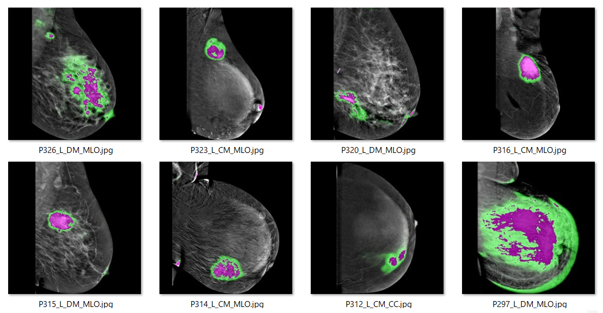
 
 

In order to improve segmentation accuracy, we will use an online dataset augmentation strategy based on Python script <a href="./src/ImageMaskAugmentor.py">
ImageMaskAugmentor.py</a> to train a Mammogram Segmentation Model.  
Please see also our first experiment 
<a href="https://github.com/sarah-antillia/Image-Segmentation-CDD-CESM-Mammogram">Image-Segmentation-CDD-CESM-Mammogram</a>
 
 
As a first trial, we use the simple UNet Model 
<a href="./src/TensorflowUNet.py">TensorflowSlightlyFlexibleUNet</a> for this Mammogram Segmentation. 
As shown in <a href="https://github.com/sarah-antillia/Tensorflow-Image-Segmentation-API">Tensorflow-Image-Segmentation-API</a>.
you may try other Tensorflow UNet Models: 

<li><a href="./src/TensorflowSwinUNet.py">TensorflowSwinUNet.py</a></li>
<li><a href="./src/TensorflowMultiResUNet.py">TensorflowMultiResUNet.py</a></li>
<li><a href="./src/TensorflowAttentionUNet.py">TensorflowAttentionUNet.py</a></li>
<li><a href="./src/TensorflowEfficientUNet.py">TensorflowEfficientUNet.py</a></li>
<li><a href="./src/TensorflowUNet3Plus.py">TensorflowUNet3Plus.py</a></li>
 

<h3>1. Dataset Citation</h3>
The image dataset used here has been taken from the following web site.

Categorized Digital Database for Low energy and Subtracted Contrast Enhanced Spectral Mammography images (CDD-CESM) 
https://wiki.cancerimagingarchive.net/pages/viewpage.action?pageId=109379611#109379611bcab02c187174a288dbcbf95d26179e8 

<b>Citations & Data Usage Policy</b> 
Users must abide by the TCIA Data Usage Policy and Restrictions. Attribution should include references to the following citations:

<b>Data Citation</b> 
<pre>
Khaled R., Helal M., Alfarghaly O., Mokhtar O., Elkorany A., El Kassas H., Fahmy A. Categorized Digital Database
for Low energy and Subtracted Contrast Enhanced Spectral Mammography images [Dataset]. (2021) The Cancer Imaging
Archive. DOI:  10.7937/29kw-ae92
</pre>

<b>Publication Citation</b> 
<pre>
Khaled, R., Helal, M., Alfarghaly, O., Mokhtar, O., Elkorany, A., El Kassas, H., & Fahmy, A. Categorized contrast
enhanced mammography dataset for diagnostic and artificial intelligence research. (2022) Scientific Data,
Volume 9, Issue 1. DOI: 10.1038/s41597-022-01238-0
</pre>

<b>TCIA Citation</b> 
<pre>
Clark K, Vendt B, Smith K, Freymann J, Kirby J, Koppel P, Moore S, Phillips S, Maffitt D, Pringle M, Tarbox L,
Prior F. The Cancer Imaging Archive (TCIA): Maintaining and Operating a Public Information Repository,
Journal of Digital Imaging, Volume 26, Number 6, Decembe
</pre>
 

<h3>
<a id="2">
2 Mammogram ImageMask Dataset
</a>
</h3>
 If you would like to train this Mammogram Segmentation model by yourself,
 please download the latest dataset from the google drive 
<a href="https://drive.google.com/file/d/1aqvLkuhGUHdw7eaF9PzxbtoduvAJ90HY/view?usp=sharing">
Mammogram-ImageMask-Dataset.zip</a>.

Please expand the downloaded ImageMaskDataset and place them under <b>./dataset</b> folder to be

<pre>
./dataset
└─Mammogram
    ├─test
    │  ├─images
    │  └─masks
    ├─train
    │  ├─images
    │  └─masks
    └─valid
        ├─images
        └─masks
</pre>
 
 
<b>Mammogram Dataset Statistics</b> 
 

As shown above, the number of images of train and valid dataset is not necessarily large. Therefore the online dataset augmentation strategy may 
be effective to improve segmentation accuracy.

 

<h3>
<a id="3">
3 TensorflowSlightlyFlexibleUNet
</a>
</h3>
This <a href="./src/TensorflowUNet.py">TensorflowUNet</a> model is slightly flexibly customizable by a configuration file. 
For example, <b>TensorflowSlightlyFlexibleUNet/Mammogram</b> model can be customizable
by using <a href="./projects/TensorflowSlightlyFlexibleUNet/Augmented-Mammogram/train_eval_infer.config">train_eval_infer.config</a>
<pre>
; train_eval_infer.config
; Pancreas, GENERATOR_MODE=True
; 2024/02/23 (C) antillia.com
; 2024/02/23 Modified to use 
; loss           = "bce_dice_loss"

[model]
generator     = True
image_width    = 512
image_height   = 512
image_channels = 3
num_classes    = 1
base_filters   = 16
base_kernels   = (5,5)
num_layers     = 7
dropout_rate   = 0.08
learning_rate  = 0.0001
clipvalue      = 0.5
dilation       = (2,2)
;loss           = "bce_iou_loss"
loss           = "bce_dice_loss"
metrics        = ["binary_accuracy"]
show_summary   = False

[train]
epochs        = 100
batch_size    = 4
steps_per_epoch  = 200
validation_steps = 100
patience      = 10
;metrics       = ["iou_coef", "val_iou_coef"]
metrics       = ["binary_accuracy", "val_binary_accuracy"]
model_dir     = "./models"
eval_dir      = "./eval"
image_datapath = "../../../dataset/Mammogram/train/images/"
mask_datapath  = "../../../dataset/Mammogram/train/masks/"
create_backup  = False
learning_rate_reducer = False
save_weights_only = True

[eval]
image_datapath = "../../../dataset/Mammogram/valid/images/"
mask_datapath  = "../../../dataset/Mammogram/valid/masks/"

[test] 
image_datapath = "../../../dataset/Mammogram/test/images/"
mask_datapath  = "../../../dataset/Mammogram/test/masks/"

[infer] 
images_dir    = "../../../dataset/Mammogram/test/images/"
output_dir    = "./test_output"
merged_dir    = "./test_output_merged"

[segmentation]
colorize      = True
black         = "black"
white         = "green"
blursize      = None

[mask]
blur      = True
blur_size = (3,3)
binarize  = True
#threshold = 128
threshold = 74

[generator]
debug     = True
augmentation   = True

[augmentor]
vflip    = False
hflip    = False
rotation = True
angles   = [5, 10,]
shrinks  = [0.8]
shears   = [0.2]
transformer = True
alpah       = 1300
sigmoid     = 8
</pre>

Please note that the online augementor 
<a href="./src/ImageMaskAugmentor.py">
ImageMaskAugmentor.py</a> reads the parameters in [generator] and [augmentor] sections, and yields some images and mask depending on the batch_size,
 which are used for each epoch of the training and evaluation process of this UNet Model. 
<pre>
[augmentor]
vflip    = False
hflip    = False
rotation = True
angles   = [5, 10,]
shrinks  = [0.8]
shears   = [0.2]
transformer = True
alpah       = 1300
sigmoid     = 8
</pre>
Depending on these parameters in [augmentor] section, it will generate rotated, shrinked,
sheared, elastic-transformed images and masks
from the original images and masks in the folders specified by image_datapath and mask_datapath in 
[train] and [eval] sections. 
<pre>
[train]
image_datapath = "../../../dataset/Mammogram/train/images/"
mask_datapath  = "../../../dataset/Mammogram/train/masks/"
[eval]
image_datapath = "../../../dataset/Mammogram/valid/images/"
mask_datapath  = "../../../dataset/Mammogram/valid/masks/"
</pre>

For more detail on ImageMaskAugmentor.py, please refer to
<a href="https://github.com/sarah-antillia/Image-Segmentation-ImageMaskDataGenerator">
Image-Segmentation-ImageMaskDataGenerator.</a>.
    
 

<h3>
3.1 Training
</h3>
Please move to a <b>./projects/TensorflowSlightlyFlexibleUNet/Augmented-Mammogram</b> folder, 
and run the following bat file to train TensorflowUNet model for Mammogram. 
<pre>
./1.train_generator.bat
</pre>
, which simply runs <a href="./src/TensorflowUNetGeneratorTrainer.py">TensorflowUNetGeneratorTrainer.py </a>
in the following way.

<pre>
python ../../../src/TensorflowUNetGeneratorTrainer.py ./train_eval_infer.config
</pre>
Train console output: 
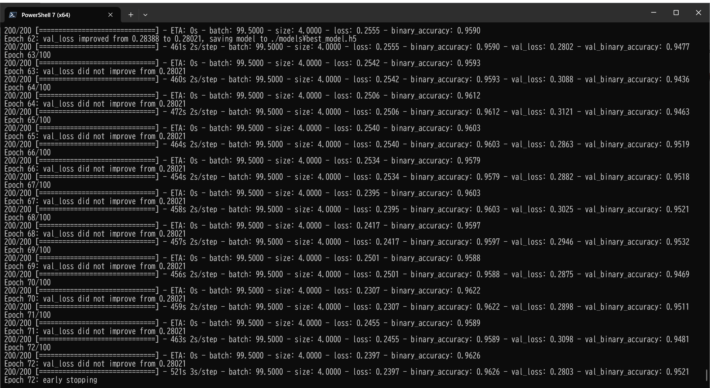 
Train metrics: 
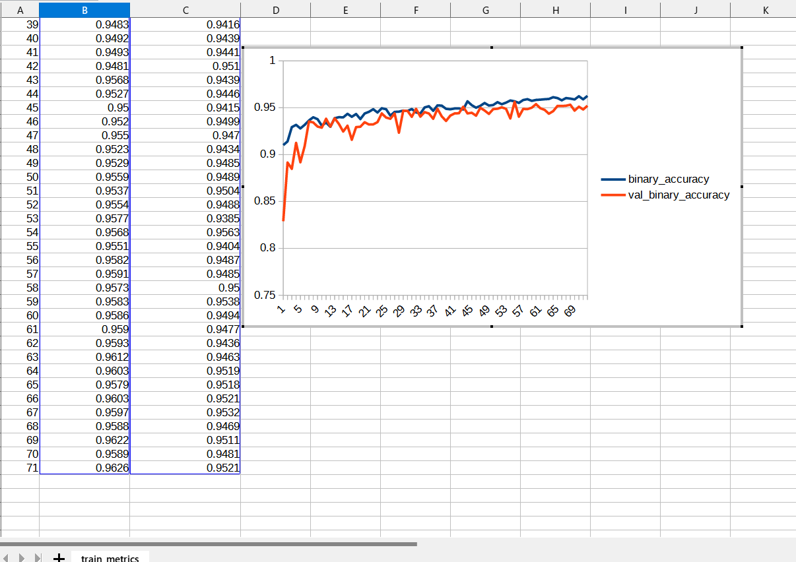 
Train losses: 
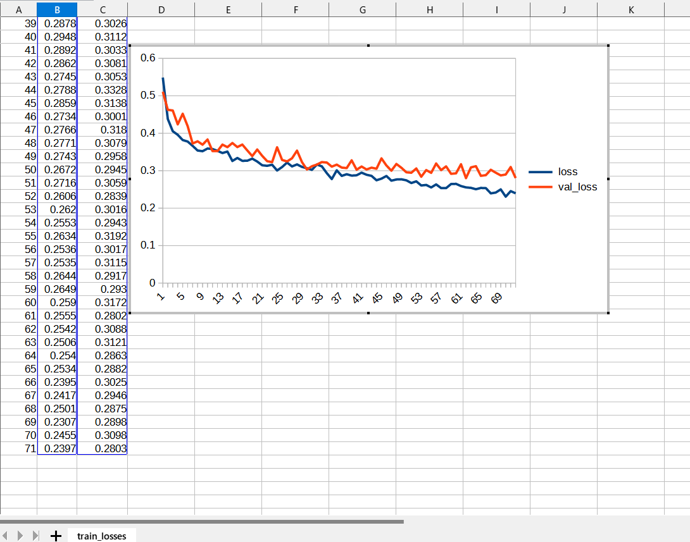 
 
The following debug setting is helpful whether your parameters in [augmentor] section are good or not good.
<pre>
[generator]
debug     = True
</pre>
You can check the yielded images and mask files used in the actual train-eval process in the following folders under
<b>./projects/TensorflowSlightlyFlexibleUNet/Augmented-Mammogram/</b>.  
<pre>
generated_images_dir
generated_masks_dir
</pre>

Sample images in generated_images_dir 
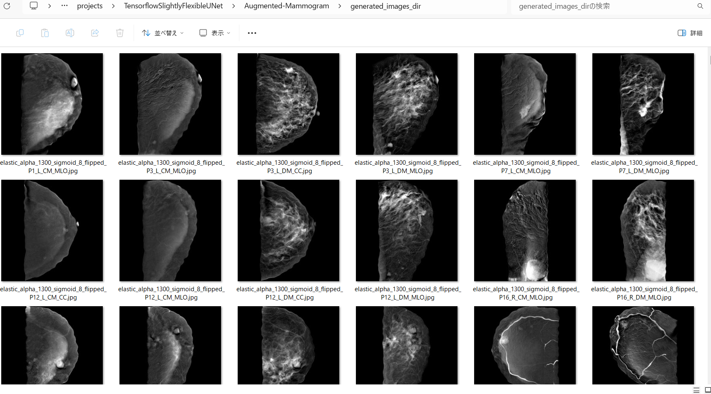 
Sample masks in generated_masks_dir 
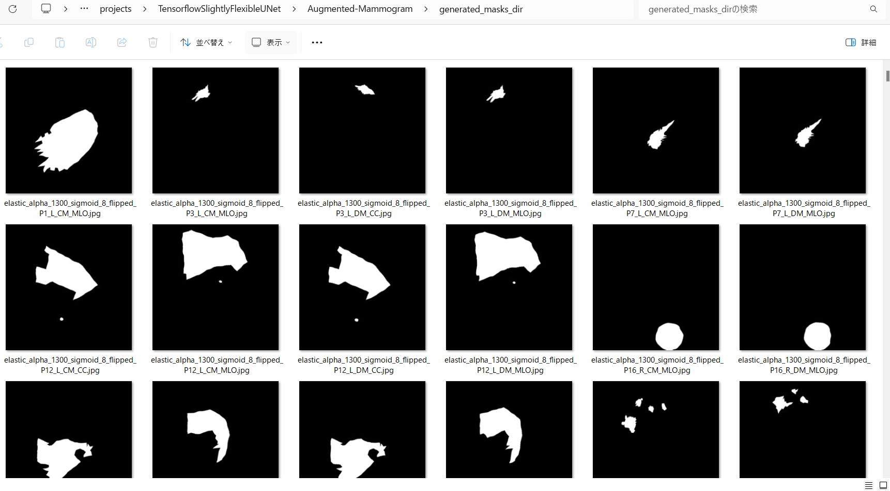 

<h3>
3.2 Evaluation
</h3>
Please move to a <b>./projects/TensorflowSlightlyFlexibleUNet/Augmented-Mammogram</b> folder, 
and run the following bat file to evaluate TensorflowUNet model for Mammogram. 
<pre>
./2.evaluate.bat
</pre>
<pre>
python ../../../src/TensorflowUNetEvaluator.py ./train_eval_infer_aug.config
</pre>
Evaluation console output: 
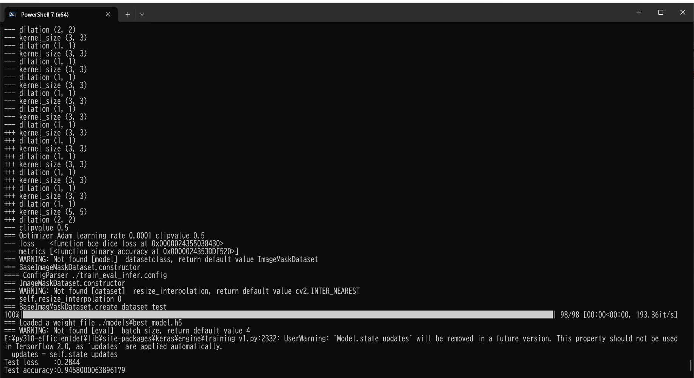

<pre>

</pre>

<h2>
3.3 Inference
</h2>
Please move to a <b>./projects/TensorflowSlightlyFlexibleUNet/Augmented-Mammogram</b> folder 
,and run the following bat file to infer segmentation regions for images by the Trained-TensorflowUNet model for Mammogram. 
<pre>
./3.infer.bat
</pre>
<pre>
python ../../../src/TensorflowUNetInferencer.py ./train_eval_infer_aug.config
</pre>
Sample test images 
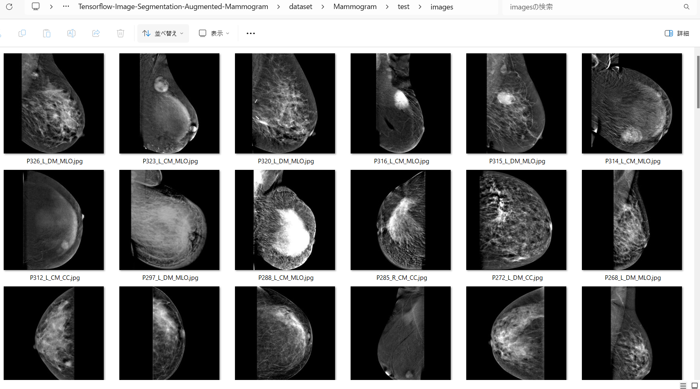 
Sample test mask (ground_truth) 
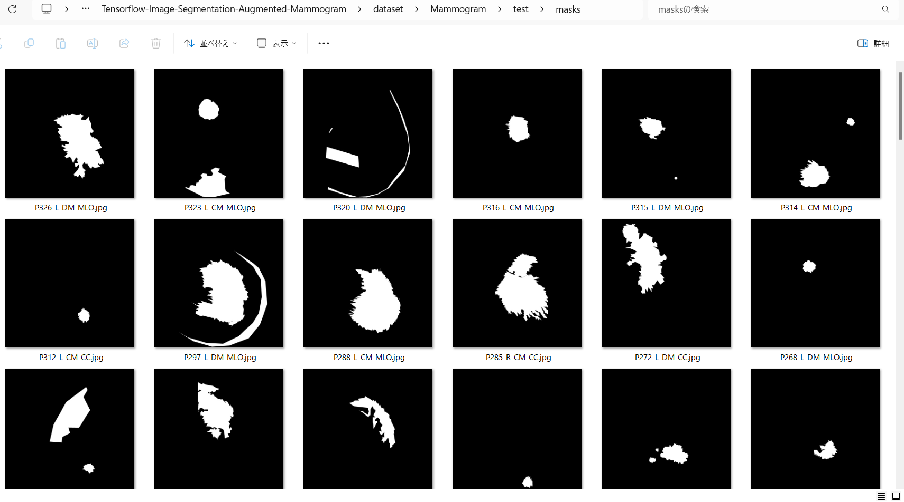 

 
Inferred test masks 
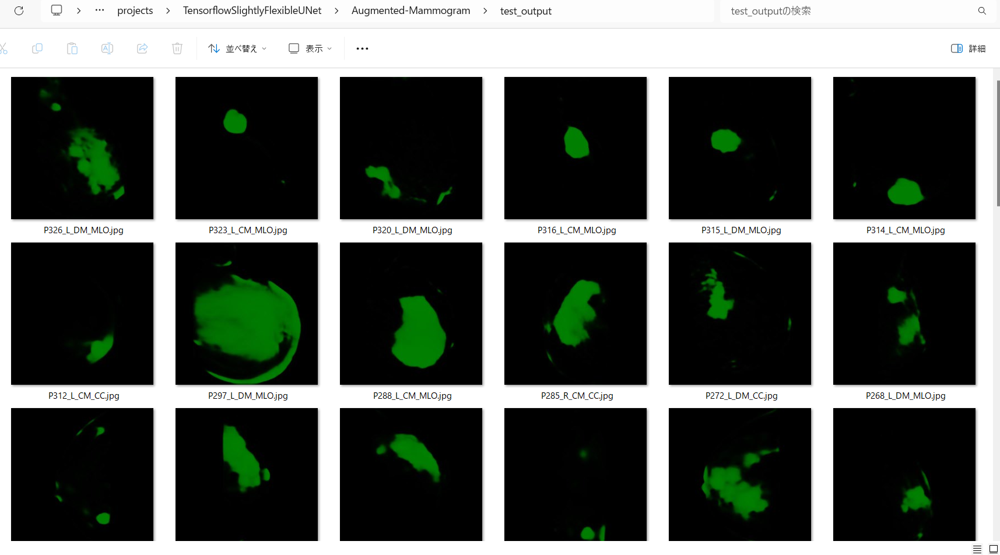 
 
Merged test images and inferred masks  
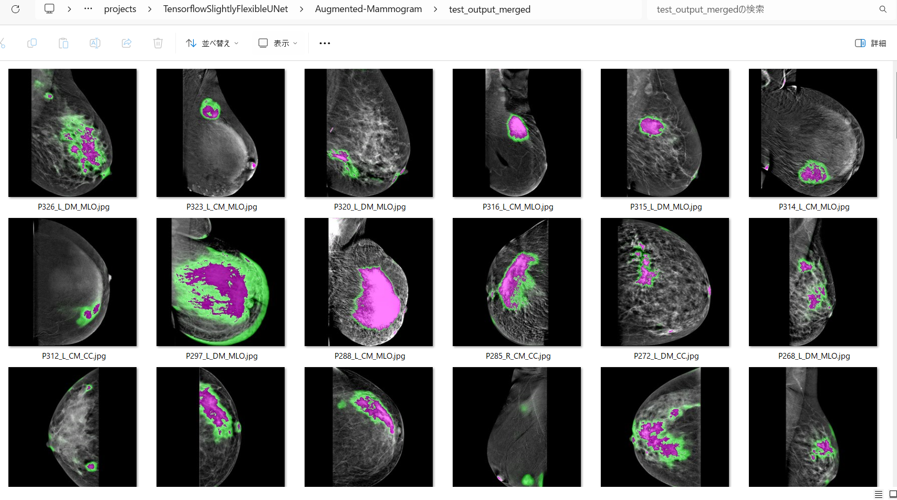  

Enlarged samples 
<table>
<tr>
<td>
test/images/P326_L_DM_MLO.jpg 

</td>
<td>
Inferred merged/P326_L_DM_MLO.jpg 
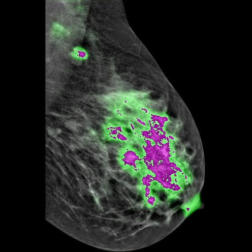
</td> 
</tr>

<tr>
<td>
test/images/P285_R_CM_CC.jpg 

</td>
<td>
Inferred merged/P285_R_CM_CC.jpg 
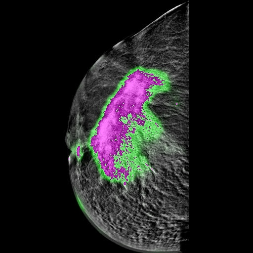
</td> 
</tr>

<tr>
<td>
test/images/P243_R_DM_CC.jpg 

</td>
<td>
Inferred merged/P243_R_DM_CC.jpg 
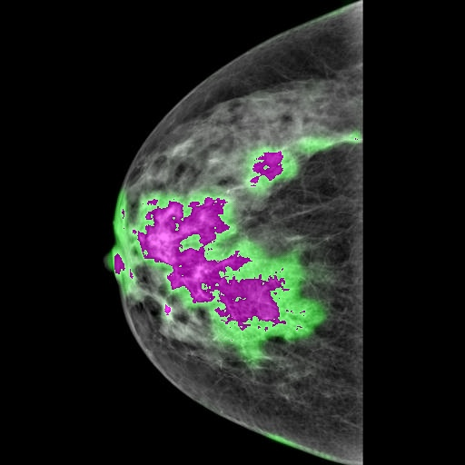
</td> 
</tr>

<tr>
<td>
test/images/mirrored_P119_L_DM_MLO.jpg 

</td>
<td>
Inferred merged/mirrored_P119_L_DM_MLO.jpg 
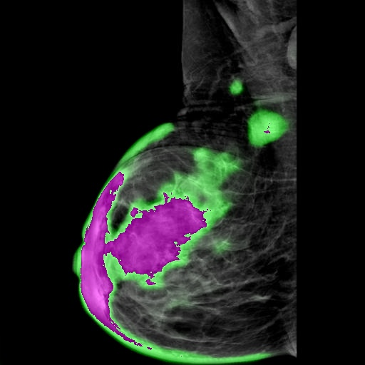
</td> 
</tr>

<!-- 5-->
<tr>
<td>
test/images/flipped_P155_L_DM_CC.jpg 

</td>
<td>
Inferred merged/flipped_P155_L_DM_CC.jpg 
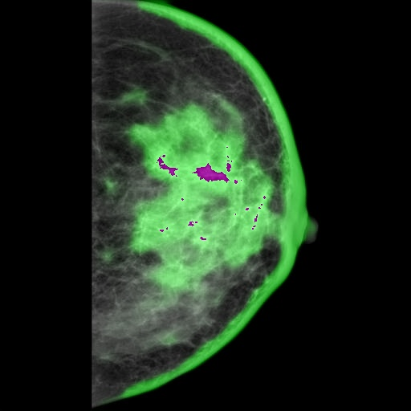
</td> 
</tr>

</table>

<h3>
References
</h3>
<b>1. Categorized contrast enhanced mammography dataset for diagnostic and artificial intelligence research </b> 
Rana Khaled, Maha Helal, Omar Alfarghaly, Omnia Mokhtar, Abeer Elkorany, Hebatalla El Kassas & Aly Fahmy 
Scientific Data volume 9, Article number: 122 (2022)  
<pre>
https://www.nature.com/articles/s41597-022-01238-0
</pre>

<b>2. Image-Segmentation-CDD-CESM-Mammogram</b> 
Toshiyuki Arai @antillia.com 
<pre>
https://github.com/sarah-antillia/Image-Segmentation-CDD-CESM-Mammogram
</pre>

<b>3. TensorflowSwinUNet-Segmentation-CDD-CESM-Mammogram </b> 
Toshiyuki Arai @antillia.com 
<pre>
https://github.com/sarah-antillia/TensorflowSwinUNet-Segmentation-CDD-CESM-Mammogram
</pre>

<b>4. Augmentation-CDD-CESM-Mammogram-Segmentation-Dataset</b> 
Toshiyuki Arai @antillia.com 
<pre>
https://github.com/sarah-antillia/Augmentation-CDD-CESM-Mammogram-Segmentation-Dataset
</pre>

