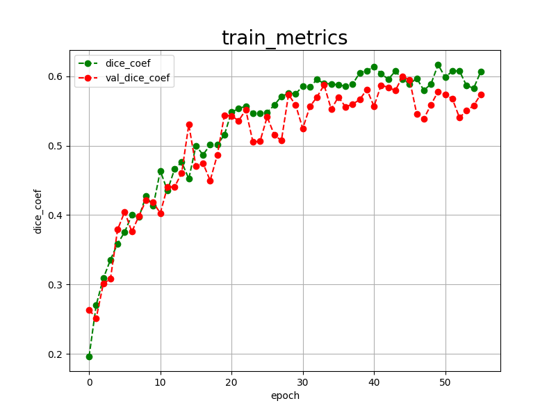

<h2>Tensorflow-Image-Segmentation-Augmented-Mammogram (Updated: 2024/10/22)</h2>
<li>
2024/10/22: Retrained Mammogram model by using the latest Tensorflow-Image-Segmentation-API.
</li>
 
This is the second experiment for Mammogram Image Segmentation based on
the latest <a href="https://github.com/sarah-antillia/Tensorflow-Image-Segmentation-API">Tensorflow-Image-Segmentation-API</a>, and
 and <a href="https://drive.google.com/file/d/1aqvLkuhGUHdw7eaF9PzxbtoduvAJ90HY/view?usp=sharing">
Mammogram-ImageMask-Dataset.zip</a>.
 
 
<b>Data Augmentation Strategy:</b> 
To address the limited size of the Mammogram dataset, we employed an online augmentation tool to enhance segmentation accuracy, which supports the following aumentation methods.
 
<li>verticalflip</li>
<li>horizontalflip</li>
<li>rotation</li>
<li>shrinks</li>
<li>shears</li>
<li>deformation</li>
<li>distortion</li>
<li>barreldistortion</li>
<li>pincushiondistortion</li>
 

<b>Actual Image Segmentation for Images of 512x512 pixels</b> 
As shown below, the inferred masks look similar to the ground truth masks.  

<table>
<tr>
<th>Input: image</th>
<th>Mask (ground_truth)</th>
<th>Prediction: inferred_mask</th>
</tr>
<tr>
<td></td>
<td></td>
<td></td>
</tr>

<tr>
<td></td>
<td></td>
<td></td>
</tr>

<tr>
<td></td>
<td></td>
<td></td>
</tr>

</table>

 
In this experiment, we used the simple UNet Model 
<a href="./src/TensorflowUNet.py">TensorflowSlightlyFlexibleUNet</a> for this Mammogram Segmentation. 
As shown in <a href="https://github.com/sarah-antillia/Tensorflow-Image-Segmentation-API">Tensorflow-Image-Segmentation-API</a>.
you may try other Tensorflow UNet Models: 

<li><a href="./src/TensorflowSwinUNet.py">TensorflowSwinUNet.py</a></li>
<li><a href="./src/TensorflowMultiResUNet.py">TensorflowMultiResUNet.py</a></li>
<li><a href="./src/TensorflowAttentionUNet.py">TensorflowAttentionUNet.py</a></li>
<li><a href="./src/TensorflowEfficientUNet.py">TensorflowEfficientUNet.py</a></li>
<li><a href="./src/TensorflowUNet3Plus.py">TensorflowUNet3Plus.py</a></li>
<li><a href="./src/TensorflowDeepLabV3Plus.py">TensorflowDeepLabV3Plus.py</a></li>
 

<h3>1. Dataset Citation</h3>

The orginal BUS-BRA dataset used here has been taken from the following web site. 
<a href="https://zenodo.org/records/8231412"><b>BUS-BRA: A Breast Ultrasound Dataset for Assessing Computer-aided Diagnosis Systems</b>
</a>
 
Wilfrido Gómez-Flores, Maria Julia Gregorio-Calas, 
Wagner Coelho de Albuquerque Pereira 

<pre>
The BUS-BRA Dataset is a publicly available dataset of anonymized breast ultrasound (BUS) images of 1,064 patients 
that underwent routinary breast studies. The BUS dataset contains biopsy-proven tumor cases and BI-RADS annotations 
in categories 2, 3, 4, and 5. In addition, the dataset also contains ground truth delineations that divide the BUS 
images into tumoral and normal regions. A full description of the BUS-BRA dataset can be found in the following article:

Wilfrido Gómez-Flores, Maria Julia Gregorio-Calas, and Wagner Coelho de Albuquerque Pereira, 
"BUS-BRA: A Breast Ultrasound Dataset for Assessing Computer-aided Diagnosis Systems," Medical Physics, 2023. (In revision)

Any research originating from its usage is required to cite this paper.

The Program of Biomedical Engineering of the Federal University of Rio de Janeiro (PEB/COPPE-UFRJ, Brazil) has a copyright 
on the data and is the principal distributor of the BUS-BRA Dataset. In addition, the Centro de Investigación y de Estudios
 Avanzados (Cinvestav, Mexico) is involved in an ongoing effort to develop this dataset to aid research efforts in developing, 
 testing, and evaluating algorithms for breast ultrasound analysis.
</pre>

<h3>
<a id="2">
2 Mammogram ImageMask Dataset
</a>
</h3>
 If you would like to train this Mammogram Segmentation model by yourself,
 and
<a href="https://drive.google.com/file/d/1aqvLkuhGUHdw7eaF9PzxbtoduvAJ90HY/view?usp=sharing">
Mammogram-ImageMask-Dataset.zip</a> , and expand the downloaded ImageMaskDataset and put it under <b>./dataset</b> folder to be

<pre>
./dataset
└─Mammogram
    ├─test
    │  ├─images
    │  └─masks
    ├─train
    │  ├─images
    │  └─masks
    └─valid
        ├─images
        └─masks
</pre>
 
<b>Mammogram_Statistics</b> 
 

As shown above, the number of images of train and valid dataset is not necessarily large. Therefore the online dataset augmentation strategy may 
be effective to improve segmentation accuracy.  
<b>Train_images_sample</b> 

 
<b>Train_masks_sample</b> 

 
 

<h3>
<a id="3">
3 TensorflowSlightlyFlexibleUNet
</a>
</h3>

This <a href="./src/TensorflowUNet.py">TensorflowUNet</a> model is slightly flexibly customizable by a configuration file. 
For example, <b>TensorflowSlightlyFlexibleUNet/Mammogram</b> model can be customizable
by using <a href="./projects/TensorflowSlightlyFlexibleUNet/Mammogram/train_eval_infer.config">train_eval_infer.config</a>

 

<h3>
3.1 Training
</h3>
Please move to a <b>./projects/TensorflowSlightlyFlexibleUNet/BUS-BRA</b> folder, 
and run the following bat file to train TensorflowUNet model for Mammogram. 
<pre>
./1.train_generator.bat
</pre>
, which simply runs <a href="./src/TensorflowUNetTrainer.py">TensorflowUNetTrainer.py </a>
in the following way.

<pre>
python ../../../src/TensorflowUNetTrainer.py ./train_eval_infer.config
</pre>

<b>Model parameters</b> 
Defined a small <b>base_filters</b> and large <b>base_kernels</b> for the first Conv Layer of Encoder Block of 
<a href="./src/TensorflowUNet.py">TensorflowUNet.py</a> 
and a large num_layers (including a bridge between Encoder and Decoder Blocks).
<pre>
[model]
base_filters   = 16
base_kernels   = (9,9)
num_layers     = 8
dropout_rate   = 0.05
learning_rate  = 0.00007
clipvalue      = 0.5
dilation       = (1,1)
</pre>

<b>Learning rate</b> 
Defined a small learning rate.  
<pre>
[model]
learning_rate  = 0.00007
</pre>

<b>Online augmentation</b> 
Enabled our online augmentation.  
<pre>
[model]
model         = "TensorflowUNet"
generator     = True
</pre>

<b>Loss and metrics functions</b> 
Specified "bce_dice_loss" and "dice_coef". 
<pre>
[model]
loss           = "bce_dice_loss"
metrics        = ["dice_coef"]
</pre>
<b>Learning rate reducer callback</b> 
Enabled learing_rate_reducer callback, and a small reducer_patience.
<pre> 
[train]
learning_rate_reducer = True
reducer_factor     = 0.4
reducer_patience   = 4
</pre>

<b>Early stopping callback</b> 
Enabled early stopping callback with patience parameter.
<pre>
[train]
patience      = 10
</pre>

<b>Epoch change inference callbacks</b> 
Enabled epoch_change_infer and epoch_changeinfer callbacks. 
<pre>
[train]
epoch_change_infer       = True
epoch_change_infer_dir   =  "./epoch_change_infer"
epoch_changeinfer        = False
epoch_changeinfer_dir    = "./epoch_changeinfer"
num_infer_images         = 6
</pre>

By using these callbacks, on every epoch_change, the inference procedures can be called
 for 6 images in <b>mini_test</b> folder. These will help you confirm how the predicted mask changes 
 at each epoch during your training process.    

<b>Epoch_change_inference output</b> 
 
 
 

Train console output: 
 
Train metrics: 
 
Train losses: 
 
 

<h3>
3.2 Evaluation
</h3>
Please move to a <b>./projects/TensorflowSlightlyFlexibleUNet/BUS-BRA</b> folder, 
and run the following bat file to evaluate TensorflowUNet model for Mammogram. 
<pre>
./2.evaluate.bat
</pre>
<pre>
python ../../../src/TensorflowUNetEvaluator.py ./train_eval_infer_aug.config
</pre>
Evaluation console output: 

  
The loss (bce_dice_loss) to this Ovarian-Tumor/test was not low, and dice_coef not high as shown below.
 
<pre>
loss,0.2775
dice_coef,0.6066
</pre>
 
<h2>
3.3 Inference
</h2>
Please move to a <b>./projects/TensorflowSlightlyFlexibleUNet/BUS-BRA</b> folder 
,and run the following bat file to infer segmentation regions for images by the Trained-TensorflowUNet model for Mammogram. 
<pre>
./3.infer.bat
</pre>
<pre>
python ../../../src/TensorflowUNetInferencer.py ./train_eval_infer_aug.config
</pre>
mini test images 
 
mini test mask (ground_truth) 
 

 
Inferred test masks 
 
<b>Enlarged images and masks </b> 

<table>
<tr>
<th>Image</th>
<th>Mask (ground_truth)</th>
<th>Inferred-mask</th>
</tr>

<tr>
<td></td>
<td></td>
<td></td>
</tr>

<tr>
<td></td>
<td></td>
<td></td>
</tr>

<tr>
<td></td>
<td></td>
<td></td>
</tr>
<tr>
<td></td>
<td></td>
<td></td>
</tr>
<tr>
<td></td>
<td></td>
<td></td>
</tr>

</table>

<h3>
References
</h3>
<b>1. BUS-BRA: A Breast Ultrasound Dataset for Assessing Computer-aided Diagnosis Systems </b> 
Wilfrido Gómez-Flores, Maria Julia Gregorio-Calas, 
Wagner Coelho de Albuquerque Pereira 
Published March 13, 2023 | Version 1.0 

<a href="https://zenodo.org/records/8231412">https://zenodo.org/records/8231412</a>
 
 
<b>2. Breast Cancer Histopathological Images Segmentation Using Deep Learning</b> 
Wafaa Rajaa Drioua, Nacéra Benamrane, and Lakhdar Sais 
Published online 2023 Aug 22. doi: 10.3390/s23177318 
<a href="https://www.ncbi.nlm.nih.gov/pmc/articles/PMC10490494/">
https://www.ncbi.nlm.nih.gov/pmc/articles/PMC10490494/
</a>
 
 
<b>3. Improving Breast Cancer Detection and Diagnosis through Semantic Segmentation Using the Unet3+ Deep Learning Framework</b> 
Taukir Alam, ORCID,Wei-Chung Shia, ORCID,Fang-Rong Hsu, ORCID andTaimoor Hassan 
iomedicines 2023, 11(6), 1536; https://doi.org/10.3390/biomedicines11061536
 <a href="https://www.mdpi.com/2227-9059/11/6/1536">
https://www.mdpi.com/2227-9059/11/6/1536</a>
 
 
<b>4. Augmentation-CDD-CESM-Mammogram-Segmentation-Dataset</b> 
Toshiyuki Arai @antillia.com 
<a href="https://github.com/sarah-antillia/Augmentation-CDD-CESM-Mammogram-Segmentation-Dataset">
https://github.com/sarah-antillia/Augmentation-CDD-CESM-Mammogram-Segmentation-Dataset
</a>

